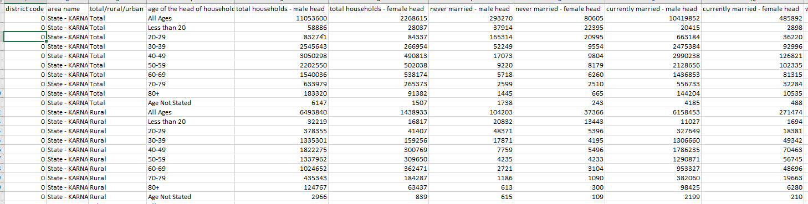

# Number-of-Male-vs-Female-lead-Households-by-Age-Groups---Karnataka-Districts
Uses a public dataset - DDW-HH06-2900-2011.csv available at data.gov.in to explore and visualize how many households in karnataka are lead by Men vs Women
Note that the dataset metadata is changed slightly before importing into dataframe for ease of data analysis.

ROW INFORMATION:

The modified dataset is as below:

from the screenshot, it is clear that the dataset has a hierarchical structure. The highest level being (KARNATAKA--Total--All Ages).

This level can be further split as (KARNATAKA--Rural--All Ages) and (KARNATAKA--Urban--All Ages)

Further,the (KARNATAKA-Total-All Ages),(KARNATAKA-Rural-All Ages) and (KARNATAKA-Urban-All Ages) levels can be split on age groups as below:

There are 3 levels below and including 'Total' (Total/Rural/Urban) and 10 levels below and including 'All Ages'. Therefore each Area should be 30 rows. Further there are 31 areas including and below 'KARNATAKA' : 

District Codes uniquely identify Areas eg. District Code 0 identifies - 'State - KARNATAKA'

COLUMN INFORMATION:

The full list of all columns is as below:

The columns as well have levels of aggregtion summaried as below:

DATA PRE-PROCESSING :

All text columns - 'area name', 'head of the head of household in years' and 'total/rural/urban' are converted to lower case.

DATA CHECKS:

1) Check to identify missing data (NULL,NaN) data in any of the data columns

2) Check to validate if district code - area name columns have a one-one mappin

3) Check to identify any unexpected values in the 'total/rural/urban' column

4) As established earlier, we expect each district code to have 30 rows associated with it. We check to validate if any districts have any missing levels

5) i) Column-sum check: total households - male head = never married - male head +currently married - male head + widowed - male head + divorced - male head + separated - male head

  ii) Column-sum check: total households - female head = never married - female head +currently married - female head + widowed - female head + divorced - female head + separated - female head
  
6) Column-sum check: total households = total households - male head + total households - female head

7) Row-sum check: all ages = SUM(Less than 20, 20-29, 30-39, 40-49, 50-59, 60-69, 70-79, 80+, Age Not Stated)

8) Row-sum check: total = rural +urban 

VISUALIZATIONS:

1) Relative proportion of male-lead vs female-lead households (all ages) by district:

The above visualization has been generated using Plotly.Districts have been arranged from left to right in increasing order of % male-lead households. It is easy to note that bangalore (88%) and bidar(86%) have the highest proportion of male-headed households while udupi(62%) and dakshina kannada(75%) have the lowest proportion. The heatmap also makes it easy to see how little the proportion of male vs female headed households varies for the rest of the areas - betweeen 79% to 85%

2) Relative proportion of male-lead vs female-lead households by age and district:

The above visualization has been generated matplotlib and mpld3. Hovering on any point on the scatterplot results in a tooltip with the relevant information. For ease of visualization, the scale of the X and Y axes are different and a X=Y line is superimposed with the scatterplot to understand the proprotion of male vs female lead households for each point. Rural areas are coded green while urban areas blue.

However the above scatter plot is obscured due to the large number of urban households in bangalore (note the blue points on the upper-right side)

The below plot excludes bangalore from the scatter plot:

This chart presents an interesing observation - the highighted data point - (udupi-rural-80+) is the ONLY data point in the dataset, even at leaf level where the number of female-lead households are greater than the number of male-lead households.

